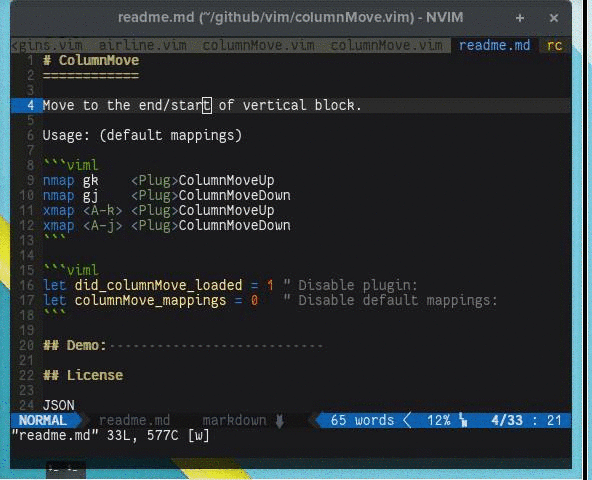

# ColumnMove
============

Move to the end/start of vertical block.

If the cursor is on a whitespace and/or virtual-column:
-> Move to the next character in column that matches `'\S'`

If the cursor is on a non-whitespace character:
-> Move to the last character in column that matches `'\S'`


Here is a low-quality screencast:




Usage: (default mappings)

```viml
nmap gk    <Plug>ColumnMoveUp
nmap gj    <Plug>ColumnMoveDown
xmap <A-k> <Plug>ColumnMoveUp
xmap <A-j> <Plug>ColumnMoveDown
```

```viml
let did_columnMove_loaded = 1 " Disable plugin:
let columnMove_mappings = 0   " Disable default mappings:
```

## Demo:                           

## License

JSON

## Credits

[Learn Vimscript the Hard Way][1] (eternal thanks to Steve Losh)

[1](http://learnvimscriptthehardway.stevelosh.com/)

